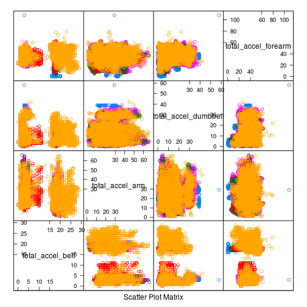
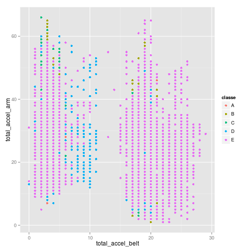
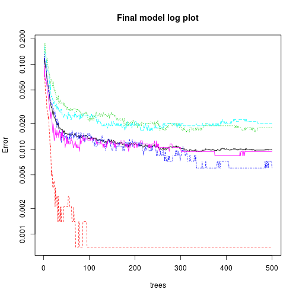

# Analysis of Weight Lifting Exercises Dataset
## Synopsis
Using devices such as Jawbone Up, Nike FuelBand, and Fitbit it is now possible to collect a large amount of data about personal activity relatively inexpensively. These type of devices are part of the quantified self movement – a group of enthusiasts who take measurements about themselves regularly to improve their health, to find patterns in their behavior, or because they are tech geeks. One thing that people regularly do is quantify how much of a particular activity they do, but they rarely quantify how well they do it. In this project,The goal will be to use data from accelerometers on the belt, forearm, arm, and dumbell of 6 participants. They were asked to perform barbell lifts correctly and incorrectly in 5 different ways. More information is available from the website here: http://groupware.les.inf.puc-rio.br/har (see the section on the Weight Lifting Exercise Dataset). 

# Building The Prediction Model

## The Problem Statement(Question)
The goal of this project is to predict the manner in which they did the exercise. This is the "classe" variable in the training set. 

## Data
The training data for this project are available here: 
https://d396qusza40orc.cloudfront.net/predmachlearn/pml-training.csv

The test data are available here: 
https://d396qusza40orc.cloudfront.net/predmachlearn/pml-testing.csv

## Loading The Data
Load the libraries we need:

```r
library(ggplot2)
library(lattice)
library(caret)
```

The next step involves loading the training data and te testing data, the training data has a total of 19622 objects having 160 variables, the predictors may contain blank value and may also contain na values.

```r
training <- read.csv("pml-training.csv", header = T)
testing <- read.csv("pml-testing.csv", header = T)
```

The data set contains a large number of redundant attributes and it is not possible to aplly any prediction model for such a large number of test cases, having so many redundant predictive drivers. Therefore the data needs to be pre-processed

## Pre-processing the data
This is one of the important steps as it lets us explore the data set much more meaningfully and also ensures that we maintain only those predictors that are actually needed to provide answers to the questions which we hope to answer.

```r
set.seed(32323)
training <- training[, colSums(is.na(training)) == 0]
i1 <- sapply(training, function(x) is.factor(x) && length(levels(x)) != 5)
training <- training[, !i1]
training <- training[, 4:57]
```

Let us see what the above few lines code do,
The very first operation that is being performed is to remove the columns that contain NA. After having viewed a subset of data it is found that there are many redundant predictors which do not represent much information i.e to say that the values are blank, therefore in order to carefully remove such predictors, all the predictors which contain factors are removed except for the classe predictor which is the label for the training data set, after this we remove the user name,timestamp variables that don't contribute much to the prediction model. The tests that were performed on the training set is repeated on the testing set

```r
testing <- testing[, colSums(is.na(testing)) == 0]
i1 <- sapply(testing, function(x) is.factor(x) && length(levels(x)) != 5)
testing <- testing[, !i1]
testing <- testing[4:57]
```

Now we build a validation data set using a very small portion of the training data set, also one important thing to be noted is in this prediction model we use only 5000 samples from the training data set, this number is sufficient to effectively train the data and make it accurate enough to predict the test data set

```r
trainInds <- sample(nrow(training), 5000)
train <- training[trainInds, ]
validationParent <- training[-trainInds, ]
validInds <- sample(nrow(validationParent), 1000)
validation <- validationParent[validInds, ]
```

## Exploratory Data plots
We begin by plotting data in order to maybe find out some kind of trend within the data set. The first attempt is using the total values present within the data set

```r
featurePlot(x = training[, c("total_accel_belt", "total_accel_arm", "total_accel_dumbbell", 
    "total_accel_forearm")], y = training$classe, plot = "pairs")
```

 

The above data plots shows the various variable plotted against each other, however no serious trend can be found out, however one thing to be noted is the plot of total_accel_arm and total_accel_belt, on carefully plotting these two variables we find that beyond a certain value of total_accel_belt a majority of the samples belong to class E.

```r
qplot(total_accel_belt, total_accel_arm, colour = classe, data = training)
```

 

##Training the data 
In computer science just as there is always a trade off between time and space, in ml there is always a trade off between time and accuracy, this prediction model goes for the accuracy, one very good reason for this is the 20 points credit for the project(sorry for being quite informal here :p). The next process involves training the data set, we use the random forest apporach because of the accuracy of the model, however one of the major risks of using the random forests approach is due to the fact that it takes a long time to compute, hence we use only a very small subset to train using the random forests approach,care is taken to see that the data set under consideration

```r
modFit <- train(classe ~ ., data = train, method = "rf", proxy = T)
```

```
## Loading required package: randomForest
## randomForest 4.6-7
## Type rfNews() to see new features/changes/bug fixes.
```

Once the model has been trained we use it to cross validate using the cross validation data set,

```r
predictionValidation <- predict(modFit, validation)
table(predictionValidation, validation$classe)
```

```
##                     
## predictionValidation   A   B   C   D   E
##                    A 289   2   0   0   0
##                    B   0 184   4   0   0
##                    C   0   2 162   1   0
##                    D   0   0   0 163   0
##                    E   0   0   0   0 193
```

The accuracy on the cross validation is about 99.3%, which is very good in terms of what is being strived to achieve, later the model is applied on the actual test data
## Applying the model to the test data set
Now we apply the model to the test data set and find out what exactly is the results

```r
prediction <- predict(modFit, testing)
table(1:20, prediction)
```

```
##     prediction
##      A B C D E
##   1  0 1 0 0 0
##   2  1 0 0 0 0
##   3  1 0 0 0 0
##   4  1 0 0 0 0
##   5  1 0 0 0 0
##   6  0 0 0 0 1
##   7  0 0 0 1 0
##   8  0 1 0 0 0
##   9  1 0 0 0 0
##   10 1 0 0 0 0
##   11 0 1 0 0 0
##   12 0 0 1 0 0
##   13 0 1 0 0 0
##   14 1 0 0 0 0
##   15 0 0 0 0 1
##   16 0 0 0 0 1
##   17 1 0 0 0 0
##   18 0 1 0 0 0
##   19 0 1 0 0 0
##   20 0 1 0 0 0
```

The final model log plot is given below

```r
plot(modFit$finalModel, log = "y", main = "Final model log plot")
```

 

