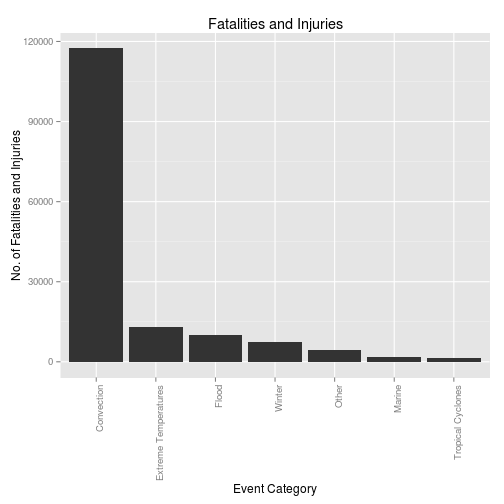
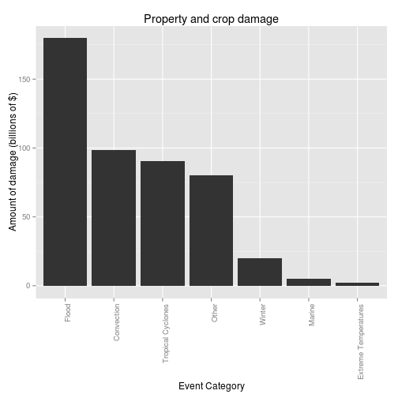

# Analysis of Fatalities, injuries and damage caused by severe weather events
## Synopsis
Based on recorded storm data from 1950 through 2011, this document tries to provide some insight into the effects of severe weather on the public. These kinds of answers can be beneficial to plan responses to severe weather events and to prepare contingency plans.

We found that convection events (Lightning, Tornadoes, Thunderstorm Wind, Hail) are the most harmful to public health. We also found that Flood events (Flash Floods, River Floods) are the most damaging to property and crops.

# Data Processing
Load the libraries we will need:

```r
library(ggplot2)
```

Our data is derived from the [NOAA Storm Database](https://d396qusza40orc.cloudfront.net/repdata%2Fdata%2FStormData.csv.bz2).  
Read in the data, mapping as many fields to numerical fields as possible. We are not converting the dates at this point, as we do not need the dates in our analysis. More information about the data file is available from the National Weather Service [Storm Data Documentation](https://d396qusza40orc.cloudfront.net/repdata%2Fpeer2_doc%2Fpd01016005curr.pdf).  

```r
data <- read.csv("repdata_data_StormData.csv.bz2", header = TRUE, sep = ",", 
    colClasses = c("numeric", "character", "character", "character", "numeric", 
        "character", "character", "character", "numeric", "character", "character", 
        "character", "character", "numeric", "character", "character", "character", 
        "character", "numeric", "numeric", "character", "numeric", "numeric", 
        "numeric", "numeric", "character", "numeric", "character", "character", 
        "character", "character", "numeric", "numeric", "numeric", "numeric", 
        "character", "numeric"))
```

The initial set has 902,297 observations. We first throw away all data that does not contain information we are interested in by filtering out data that did not cause fatalities, injuries or damage.  

```r
smallData <- data[data$FATALITIES > 0 | data$INJURIES > 0 | data$PROPDMG > 0 | 
    data$CROPDMG > 0, ]
```

This leaves us with 254,633 observations.  
The EVTYPE fields contains a large number of errors and issues. In order to report on the data, we will add an additional column named category that contains the event category as used by the NCDC: - convection  
- extreme temperature
- flood
- marine
- tropical cyclon
- winter
- other
This is also the order of importance with which we will treat the various events. Convection events are the most important, so this order will also decide the tie-breaker if an event belongs to more than one category. 

```r
convection <- c("?.*LIGHTING|LIGHTN|LIGNTNING|TORNADO|TORNDAO|WIND|TSTM|THUNDER|WND|HAIL|TURBULENCE|GUSTNADO?.*")
temperature <- c("?.*COLD|HEAT|WARM|TEMPERATURE|THERMIA?.*")
flood <- c("?.*FLOOD|RISING|STREAM FLD?.*")
marine <- c("?.*COASTAL|TSUNAMI|CURRENT|SWELLS|TIDE|WAVE|SEAS|SURF|HIGH WATER?.*")
cyclones <- c("?.*CYCLONE|HURRICANE|TYPHOON?.*")
winter <- c("?.*WINT|ICE|AVALAN|SLEET|SNOW|FREEZ|BLIZZ|FROST|GLAZE|MIXED?.*")

smallData[grepl(winter, smallData$EVTYPE, ignore.case = TRUE), "category"] = "Winter"
smallData[grepl(cyclones, smallData$EVTYPE, ignore.case = TRUE), "category"] = "Tropical Cyclones"
smallData[grepl(marine, smallData$EVTYPE, ignore.case = TRUE), "category"] = "Marine"
smallData[grepl(flood, smallData$EVTYPE, ignore.case = TRUE), "category"] = "Flood"
smallData[grepl(temperature, smallData$EVTYPE, ignore.case = TRUE), "category"] = "Extreme Temperatures"
smallData[grepl(convection, smallData$EVTYPE, ignore.case = TRUE), "category"] = "Convection"
smallData[is.na(smallData$category), "category"] = "Other"
```

The PROPDMG and CROPDMG fields need some conversion before we can do math on them. Here is the code for that. We add two extra columns that contain the property and crop damage.  

```r
smallData$propertydamageEXP = 1
smallData[grepl("h|H", smallData$PROPDMGEXP, ignore.case = TRUE), "propertydamageEXP"] = 100
smallData[grepl("k|K", smallData$PROPDMGEXP, ignore.case = TRUE), "propertydamageEXP"] = 1000
smallData[grepl("m|M", smallData$PROPDMGEXP, ignore.case = TRUE), "propertydamageEXP"] = 1e+06
smallData[grepl("b|B", smallData$PROPDMGEXP, ignore.case = TRUE), "propertydamageEXP"] = 1e+09
smallData$propertydamage = smallData$PROPDMG * smallData$propertydamageEXP

smallData$cropdamageEXP = 1
smallData[grepl("k|K", smallData$CROPDMGEXP, ignore.case = TRUE), "cropdamageEXP"] = 1000
smallData[grepl("m|M", smallData$CROPDMGEXP, ignore.case = TRUE), "cropdamageEXP"] = 1e+06
smallData[grepl("b|B", smallData$CROPDMGEXP, ignore.case = TRUE), "cropdamageEXP"] = 1e+09
smallData$cropdamage = smallData$CROPDMG * smallData$cropdamageEXP
```

### Results
## Severe weather events that cause the largest number of incidents
Calculate a total of all fatalities and injuries, so that we can find what events have the highest number of incidents. The new column is called incidents.  

```r
smallData$incidents = smallData$FATALITIES + smallData$INJURIES
```

We create a new set with the aggregate of the incidents grouped by the event types.

```r
incidentData <- aggregate(list(incidents = smallData$incidents), by = list(event = smallData$category), 
    FUN = sum, na.rm = TRUE)
```

Here is the overview of the event categories with the number of incidents  

```r
incidentData$event <- reorder(incidentData$event, -incidentData$incidents)
ggplot(incidentData, aes(y = incidents)) + theme(axis.text.x = element_text(angle = 90, 
    hjust = 1)) + geom_bar(aes(x = event), data = incidentData, stat = "identity") + 
    ggtitle("Fatalities and Injuries") + xlab("Event Category") + ylab("No. of Fatalities and Injuries")
```

 

Clearly the convection events (Lightning, Tornadoes, Thunderstorm Wind, Hail) has the greatest effect on injury and fatality.
## Severe weather events that cause the largest amount of damage
Add a field with a total of all damage, both to property as well as to crop, so that we can find our what events cause the highest amount of damage. The new column is called damage. The column is in billions of dollars.  

```r
smallData$damage = ((smallData$propertydamage + smallData$cropdamage)/1e+09)
```

We create a new set with the aggregate of the damage grouped by the event types.  

```r
damageData <- aggregate(list(damage = smallData$damage), by = list(event = smallData$category), 
    FUN = sum, na.rm = TRUE)
```

Here is the overview of the event categories with the amount of damage  

```r
damageData$event <- reorder(damageData$event, -damageData$damage)
ggplot(damageData, aes(y = damage)) + theme(axis.text.x = element_text(angle = 90, 
    hjust = 1)) + geom_bar(aes(x = event), data = damageData, stat = "identity") + 
    ggtitle("Property and crop damage") + xlab("Event Category") + ylab("Amount of damage (billions of $)")
```

 

Clearly the flooding events (Flash Flood, River Flood) have the greatest effect on property damage and crop damage.
